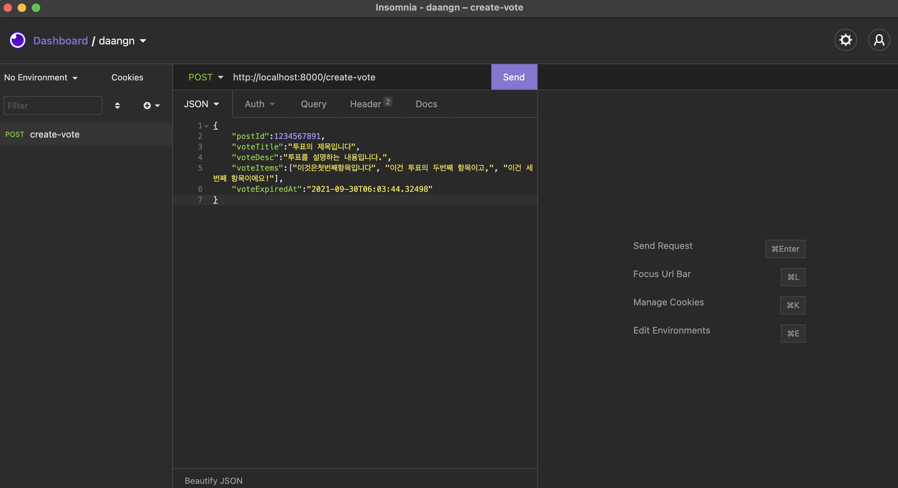

## 테스트 환경

- Macbook pro (Apple M1, macOS Big Sur, 11.2.2)
- Docker (version 20.10.5, build 55c4c88)
- Insomnia (postman 과 비슷한 API 테스트 도구) https://insomnia.rest/download

## 테스트 과정(summary)

0. 도커를 설치하고 백그라운드 데몬으로 실행시킵니다.
1. 압축파일을 해제합니다.
2. 압축파일에서 나온 폴더 루트로 이동합니다.
3. CLI 상에 docker-compose up 명령어를 입력하면 node 이미지와 postgresql 이미지가 다운로드 되고, 데이터베이스 테이블이 설정됩니다. 처음 node 와 postgresql 이미지를 다운받고 설정이 완료되는데 몇분정도 소요됩니다.
4. Insomnia 를 실행해서 API Request 를 보냅니다(Insomnia 사용법은 문서 하단을 참고해주세요). Insomnia 뿐만 아니라 postman, 또는 curl 명령어 같이 http request 를 보낼 수 있는 도구는 무엇이든 괜찮습니다.

> 만약 테스트 과정에서 문제가 생긴다면, http://ec2-54-180-26-252.ap-northeast-2.compute.amazonaws.com:8000/ 주소로 api 요청을 부탁드립니다.

## Sample APIs

request url : http://localhost:8000

userId : 4자리 문자열
postId : 64bit long
voteId : 10자리 문자열. 사용자가 투표를 만들면 js nanoid 모듈을 통해 생성.

### Request headers

- Content-type: application/json
- x-user-id: abcd

### Request body

#### POST /create-vote

투표를 생성하는 API.

```
// request body
{
    "postId":1234567890,
    "voteTitle":"투표의 제목입니다",
    "voteDesc":"투표를 설명하는 내용입니다.",
    "voteItems":["이것은첫번째항목입니다", "이건 투표의 두번째 항목이고,", "이건 세번째 항목이에요!"],
    "voteExpiredAt":"2021-09-30T06:03:44.32498"
}
```

```
// expected resoponse
{
  "voteId": "XS4jY-5j2j"
}
```

- voteDesc 또는 voteExpiredAt 는 옵셔널입니다. API request 에 포함되어 있지 않다면 서버측에서 default 값을 입력해 처리합니다.
- voteItems 는 string 을 담고 있는 배열입니다. 배열의 숫자가 2개~100개 사이가 아니라면 서버쪽에서 안내메시지를 반환합니다.

#### POST /read-vote

투표의 정보를 조회하는 api.

```
// request body
{
	"postId":1234567890,
	"voteId": "XS4jY-5j2j" // create-vote api 의 반환값으로 나온 voteId
}
```

```
// expected response
{
  "voteCreator": "abcd",
  "voteTitle": "투표의 제목입니다",
  "voteDesc": "투표를 설명하는 내용입니다.",
  "voteExpiredAt": "2021-09-30T06:03:44.324Z",
  "isVoted": false,
  "voteItems": [
    {
      "content": "이것은첫번째항목입니다",
      "item_order": 0,
      "item_id": 5,
      "count": "0"
    },
    {
      "content": "이건 투표의 두번째 항목이고,",
      "item_order": 1,
      "item_id": 6,
      "count": "0"
    },
    {
      "content": "이건 세번째 항목이에요!",
      "item_order": 2,
      "item_id": 7,
      "count": "0"
    }
  ]
}
```

- 만약 사용자가 해당 투표에 투표를 한 이력이 있다면, isVote=true 로 반환됩니다.
- count 항목은 해당 투표항목이 몇표를 받았는지에 대한 정보입니다.
- item_order 는 투표항목이 생성된 순서입니다.
- 항목의 갯수가 범위(2~100)를 벗어나거나, 글자수가 너무 많거나 하면 서버가 잘못된 값이라는 안내메시지를 반환합니다.
- 만약 옵셔널이 아닌 항목이 누락돼 있으면 500번 응답을 반환합니다.

#### POST /select-vote

투표를 하는 api.

```
// request body
{
	"postId":1234567890,
	"voteId": "XS4jY-5j2j" // <create-vote api 의 반환값으로 나온 voteId>,
	"voteItemId": 7 // <read-vote api 의 반환값으로 알 수 있는 각 투표 항목별 item_id>
}
```

```
// expected response
{
  "result": "success"
}
```

- 만약 투표의 유효기간을 넘겼는데 투표를 했거나,
- 이미 투표했는데 다시 투표를 하거나,
- 존재하지 않는 항목에 투표를 했을 경우, failure 를 반환합니다.

## Others

#### trouble shooting

- 사용된 스택은 NodeJS + Express + PostgreSQL + Docker compose 입니다.
- 만약 docker-compose up 명령어가 작동하지 않거나, 작동해도 문제가 생긴다면 로컬에 node 14와 postgresql 13을 설치해서 테스트할 수 있습니다... 만약 그런 상황이 생긴다면, 번거롭게 해서 정말 죄송하다는 마음 뿐입니다...
- postgresql 데이터베이스의 테이블 구조는 ./init/init.sql 에 작성돼 있습니다.
  > 또는 http://ec2-54-180-26-252.ap-northeast-2.compute.amazonaws.com:8000/ 주소로 api 요청을 부탁드립니다.

#### Insomnia 사용법

1. 홈페이지에서 실행파일을 설치합니다. https://insomnia.rest/download


2. request collection 을 생성합니다.


3. new request 를 클릭합니다.


4. request 의 이름을 정하고(아무렇게나 입력해도 상관없어요) POST 를 골라줍니다.


5. body 항목을 JSON 으로 선택하고, Headers 항목에 x-user-id 를 추가해줍니다. 요청을 보낼 url 을 입력하고, body 에 json 을 작성한후 send 를 누릅니다.


